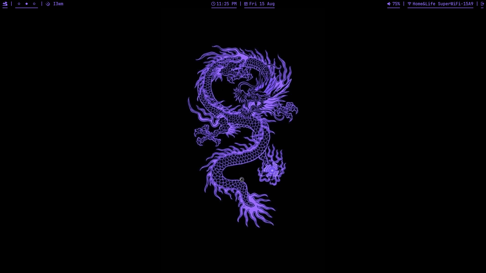

# i3 rice — My X11 Setup

A minimal and clean i3 configuration with custom polybar,Rofi menu and Rofi PowerMenu.

---

## Screenshots

### Desktop


### Wallpaper 


---

## What was used? 

- **Window Manager:** [i3](https://github.com/i3/i3)
- **Launcher:** [Rofi](https://github.com/davatorium/rofi)
- **Bar:** [Polybar](https://github.com/polybar/polybar)
- **Wallpaper Enginer:** [Nitrogen](https://wiki.archlinux.org/title/Nitrogen)

## Requirmeants? (Fonts mainly for rofi and waybar. Move them to ~/.local/share/fonts. [if directory doesnt exist make it.]. Once moved unzip them all in there, and then reboot.)
- **JetBrainsMono Nerd: ** [Download here](https://github.com/ryanoasis/nerd-fonts/releases/download/v3.4.0/JetBrainsMono.zip)
- **Fira Code Nerd Font: ** [Download here](https://github.com/ryanoasis/nerd-fonts/releases/download/v3.4.0/FiraCode.zip)
- **Hack Nerd Font: ** [Download here](https://github.com/ryanoasis/nerd-fonts/releases/download/v3.4.0/Hack.zip)


---

## Installation

Clone this repository:

**HTTPS:**
```bash
git clone https://github.com/sxmplyfarhan/Farhans-Sway-Rice
